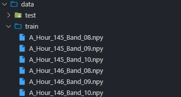

# A Baseline of Typhoon Prediction

It's a simple but complete baseline of the [competition](https://tianchi.aliyun.com/competition/entrance/231729/introduction).

## Usage

### Preparation

First you need to download the original data provided and extract the files as follows:



And you need to satisfy the requirements to run the code (The version does not need to be matched):

```
scipy==1.1.0
numpy==1.17.0
pytorch==1.1.0
torchvision==0.2.2
opencv==3.4.1
pillow==5.1.0
```

*Note: In order to reduce the read time, the read data will be stored in memory. If your PC (or server) doesn't have enough memory, just reduce the dataset.*

### Modify

You need to modify the code by yourself, such as:

1. If you don't have a GPU, you need to remove `.cuda()` and `.cpu()` in the code.
2. If there is `out of memory` soon after starting training on GPU, please reduce `batch_size` and `patch_size`. (The baseline model is very simple, generally it won't happen.)
3. ...

### Model

This baseline uses a 3-layer 3D convolutional network. Training the model directly will not yield satisfactory results, so you need to modify the model such as increasing the number of convolutional layers.

### Process

Process the lost data and convert it into images:

```
python process.py
```

This code provides one way to process the dataset. For other data processing and loading methods, please check the forum.

### Start

Training:

```
python train.py
```

Predicting：

```
python predict.py
```

The output files will be in `./result/final/`. 

After that, just package the results and upload the archive (Do not pack the `final` folder).